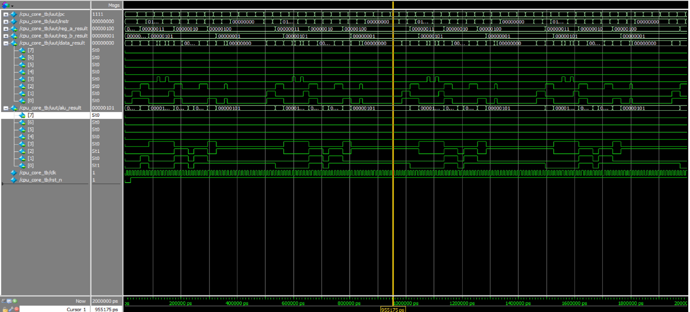

# 🧠 MiniCPU_v2 – Enhanced Minimal CPU Design

This project presents a simplified CPU core written in Verilog RTL, featuring basic instruction execution and arithmetic capability. It includes a full simulation testbench with waveform output verified in ModelSim.

---

## 📋 Instruction Set Architecture (ISA)

| Opcode (instr[7:4]) | Instruction | Description               |
|---------------------|-------------|---------------------------|
| `0001`              | LOAD A      | Load `instr[3:0]` into Register A |
| `0010`              | LOAD B      | Load `instr[3:0]` into Register B |
| `0100`              | ADD         | ALU performs `A + B`      |
| `0101`              | SUB         | ALU performs `A - B`      |
| `0110`              | STORE       | Store ALU result to `data_result` |

---

## 🧩 Module Overview

- `cpu_core.v`: Top-level CPU integration module  
- `instr_mem.v`: Instruction ROM (hard-coded example)  
- `reg_file.v`: Register file with Register A and B  
- `alu.v`: Arithmetic Logic Unit (supports ADD & SUB)  
- `control_unit.v`: Finite State Machine (FSM) control logic  
- `cpu_core_tb.v`: Testbench for simulation

---

## 🖼️ Waveform Result

The following waveform illustrates execution of the 4 instructions:  
**LOAD A → LOAD B → ADD → STORE**

- PC increments sequentially  
- `reg_a` and `reg_b` are loaded correctly  
- ALU outputs result = 3  
- Result is latched into `data_result`

---

## 🛠️ Development Environment

- Language: Verilog RTL  
- Simulator: ModelSim (Intel FPGA Edition)  
- Clock: 100 MHz (10 ns period)  
- Simulation duration: 2 μs

---

## 📌 Potential Enhancements

- Add more ALU operations (AND, OR, XOR, etc.)
- Implement Jump / Branch instructions
- Integrate memory access (RAM, I/O)
- Convert ROM to writable memory
- Connect to UART for serial output display

---

## 🙌 About

This is a self-contained CPU design for RTL learning, simulation practice, and architecture experimentation.  
Feel free to fork, extend, and build upon it!

